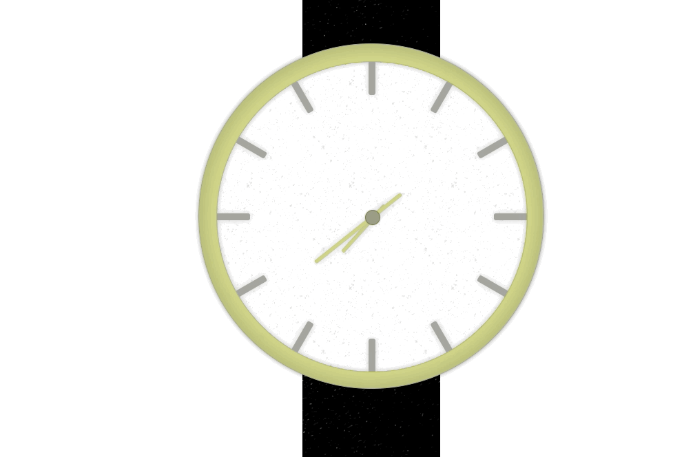

# Analog Clocks

[Website](https://bloomca.github.io/analog-clocks/index.html)

This is a simple website showing different analog clocks using CSS/JS. There is no real purpose in this website, I just built it because I can. These clocks are not real, I just use some real for inspiration.

## License

MIT